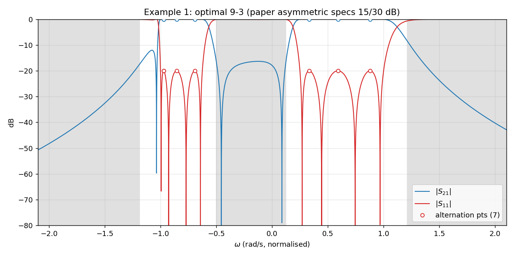
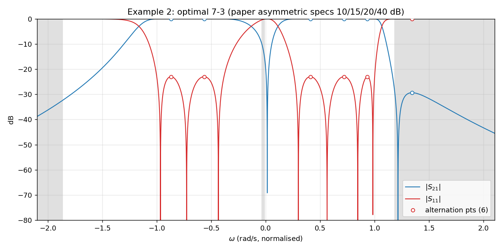

# Multiband Zolotarev filter synthesis

> **Certified-optimal characteristic-function synthesis for multiband
> microwave filters** — the algorithm of
> [Lunot, Seyfert, Bila & Nasser, IEEE T-MTT, 2008](https://ieeexplore.ieee.org/document/4395021),
> implemented as a Python reference **and** a browser solver (C++ → WebAssembly).

**🔗 Live demo:**
[jedrzejmichalczyk.github.io/multiband](https://jedrzejmichalczyk.github.io/multiband/)

No install, no sign-in — paste in passbands, stopbands, and target dB values,
click *Synthesise filter*, and the browser runs the same LP-based
differential-correction algorithm the paper describes, with an
equiripple-like alternation certificate for global optimality.

## What this gives you

- Enter any number of passbands **I** and stopbands **J** on a
  normalised ω axis.
- Per-band targets: **return loss (dB)** in each passband and **rejection
  (dB)** in each stopband — the latter can differ per interval, which
  is the whole point of the Lunot et al. 2008 paper.
- The solver returns a characteristic function
  `D(ω) = F(ω) / P(ω)` (real-coefficient polynomials) that
  maximises the worst-case dB margin over the stopband targets while
  respecting the passband return-loss constraint, and certifies a
  bracket `M ≤ M* ≤ M_upper` around the optimum.
- You get: `|S₂₁|`, `|S₁₁|` trace on a dB plot with target lines
  overlaid, a per-band achieved-vs-target table (green = met,
  red = missed), the list of reflection / transmission zeros, and
  the final polynomial coefficients.

## Paper examples reproduced

Example 1 (dual-band 9-3, paper's asymmetric 15 / 30 dB spec) and
Example 2 (dual-band 7-3, 10 / 15 / 20 / 40 dB spec) are available as
one-click presets in the UI.  Python-reference versions that generated
these plots:

| Example 1 (9-3) | Example 2 (7-3) |
| --- | --- |
|  |  |

## How it works (short tour)

The Zolotarev problem posed by the paper is

> maximise `M = min_{ω∈J} |F/P| / w_J(ω)` subject to `|F/P| ≤ ψ_I(ω)` on `I`

where `ψ_I`, `ψ_J` come from the user's dB specs and the stopband
weight is `w_J = ψ_J` where a target is given, else 1 (§V.D of the
paper: the rejection target enters *multiplicatively*, so the optimum
exceeds every band's target by the same dB margin `20·log10 M` and
every band stays binding).  For each sign combination on the
intervals:

1. **Sample** the intervals on Chebyshev-Lobatto nodes.
2. Assemble an LP whose variables are the Chebyshev coefficients of
   `F` and `P`, plus the scalar slack `h`.
3. Solve the LP with [HiGHS](https://highs.dev) (same solver
   `scipy.optimize.linprog` uses under the hood).
4. **Remez-style exchange**: densely sample between the Chebyshev
   nodes; any point violating the continuous constraint joins the
   sample set and we re-solve from scratch (warm-starting from the
   previous basis was measured to produce false infeasibility
   verdicts on this ill-conditioned model).  Iterate until the
   solution is valid on the whole continuum.
5. Iterate the differential correction of eq. (14) in the paper
   (with the `|F_{k-1}|` denominator, which gives quadratic
   convergence near the optimum).
6. **Feasibility-kick refinement.**  The DC iteration alone is
   vertex-luck-sensitive: the LP has massively degenerate optimal
   faces, and which vertex the solver happens to return decides which
   valley DC follows (the same spec has been observed converging to
   `M = 1.62` with one HiGHS build and `M = 15.16` with another).
   After DC stalls, the solver probes the *convex* feasibility test
   "does a candidate with slack > L exist?" at levels above the
   incumbent: a feasible probe yields a strictly better witness (DC
   resumes from it, kick doubles — geometric climb), an infeasible
   one is a certificate that no candidate beats `L`.  Probes are
   cross-checked under both `h` normalisations and both `σ_J`
   mirrors, so a certificate requires four independent solver runs
   to agree.
7. Every accepted candidate is **dense-verified**: it is rescaled
   (`F → F/ratio`) so the return-loss constraint holds on the whole
   continuum, not just at LP samples, and its reported `M` is the
   dense minimum over the stopbands.

The winning sign combination is the one with the largest certified M.
The result reports the bracket `M ≤ M* ≤ M_upper` together with the
alternation-point count (≥ `nF + nP + 2` certifies equiripple
optimality per §IV.B of the paper); both appear in the UI under the
M badge.

## Repository layout

```
.
├── multiband_synthesis.py  ← Python reference implementation
├── examples.py             ← reproduces paper Figures 4 and 5
├── test_sanity.py          ← Chebyshev T2 / T4 sanity check
├── lunot2008.pdf           ← the paper itself
├── web/
│   ├── src/                ← C++17 port of the solver
│   │   ├── solver.hpp / solver.cpp
│   │   ├── solver_json.cpp (Emscripten bindings + JSON I/O)
│   │   └── mini_json.hpp   (header-only JSON, no external deps)
│   ├── CMakeLists.txt      ← native or Emscripten build; HiGHS via FetchContent
│   ├── ui/                 ← static single-page site
│   │   ├── index.html / app.js / style.css
│   │   └── presets.js      (paper examples one-click presets)
│   ├── test_wasm.mjs       ← Node harness that runs the WASM and
│   │                         asserts parity with the Python reference
│   └── README.md           ← build instructions (Emscripten, local serve)
└── .github/workflows/pages.yml   ← builds WASM in CI, deploys to Pages
```

## Run the Python reference

```sh
python -m pip install numpy scipy matplotlib
python examples.py              # produces example1.png and example2.png
python test_sanity.py           # Chebyshev T2 recovery
```

## Build the browser solver locally

Needs [emsdk](https://emscripten.org/docs/getting_started/downloads.html):

```sh
cd web
emcmake cmake -S . -B build-wasm -DCMAKE_BUILD_TYPE=Release
cmake --build build-wasm -j
cd ui && python -m http.server 8000
# open http://localhost:8000
```

`node web/test_wasm.mjs` runs the same WASM from Node and compares M
against the Python reference on four test cases.

## References

- **V. Lunot, F. Seyfert, S. Bila, A. Nasser.**
  *Certified Computation of Optimal Multiband Filtering Functions.*
  IEEE Trans. Microwave Theory & Techniques 56(1), pp. 105–112, Jan 2008.
  [DOI 10.1109/TMTT.2007.912234](https://doi.org/10.1109/TMTT.2007.912234).
  Included in this repo as `lunot2008.pdf`.
- R. J. Cameron. *General coupling matrix synthesis methods for
  Chebyshev filtering functions.* IEEE T-MTT 47(4), 1999.
- [HiGHS](https://highs.dev) — linear / mixed-integer optimisation
  library (LP back-end).

## License

MIT — see [LICENSE](LICENSE).
